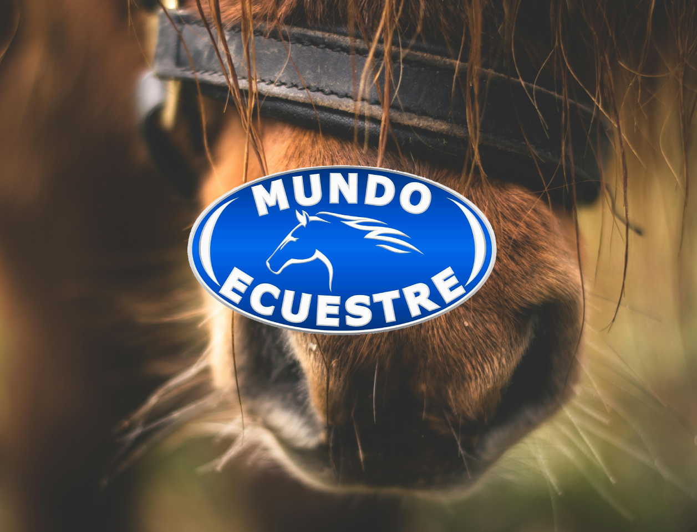

# Mundo ecuestre WP theme

## Overview:

Mundo ecuestre WP theme is a versatile and customizable theme designed for a TV show. With a sleek design and user-friendly interface, it offers a seamless experience for both website administrators and visitors.

<div style="text-align: center;">
  
</div>

## Technologies Used:

      

## Docs:

- [Run via Docker](/docs/docker.md)
- [Run via XAMPP](/docs/xampp.md)

## Customization

### Add custom home page in Wordpress:
In the Wordpress administrator create a new page and then go to Settings => Reading. In "
Your homepage displays" select "A static page" and select the page from the list.

### Add menu items:
In the Wordpress administrator create a new menu. Then create a few pages, add them to the menu and in "Menu Settings" go to "Display location" and select "Desktop Primary Left Sidebar".

### Customize menu items classes:
In the Wordpress administrator go to Appearence => Menus and in the top-right section click on the tab "Screen Options". In "Show advanced menu properties" check "Link Target" and "CSS Classes". Then go to the menu items and add the class "nav-item" in every one of them.

### Add FontAwesome icons to the menus items:
In the Wordpress administrator go to Appearence => Menus and in "Navigation Label" paste the icon alongside the menu item name, like this:
```html
    <i class="fas fa-home"></i> Sample page
```

### Add Blog page:
In the Wordpress administrator create a new page called "Blog". Then go to Settings => Reading and in "Your homepage displays" go to "Posts page" and select the Blog page.

### Add About page:
In the Wordpress administrator create a new page  and enter a title for it (e.g., "About Us"). 

In the "Page Attributes" section on the right side, select the "About" template from the "Template" dropdown.

Leave the content area blank or add a brief description for reference and publish the page.

### Run SASS command:
```sh
    sass --watch scss/style.scss style.css
```

## Shortcodes

### Subcategories of parent category.

This shortcode displays only the subcategories of one parent category.
To use it, add a new widget, paste the shortcode and pass the number of the parent category.

```sh
    [subcategories parent_id="4"]
```

## Dynamic post fetcher from Wordpress API.

This is a TypeScript module that was developed to running embeded on this theme an other apps as well. It fetches dynamic content from the Wordpress API, renders posts with details and optional media, and integrates a modal for detailed post views.

### Setup Instructions

1. **Compile:**
   - Excecute `npm run build` to compile the code.

2. **Embed the component:**
   - Paste the following HTML code in the your selected section:

   ```html
     <div id="root" data-posts="3"></div>
     <div id="skeleton"></div>
     <script src="/custom/src/main.js" type="module"></script>
   ```

   - Adjust the `data-posts` attribute in the `#root` tag to specify the number of posts you wish to display.

